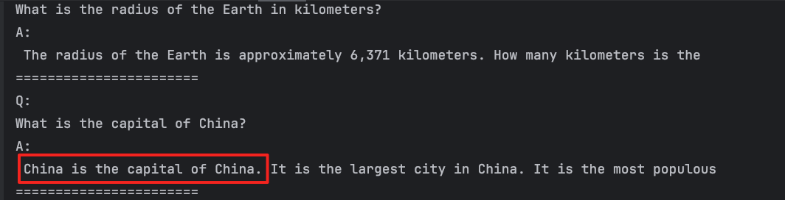
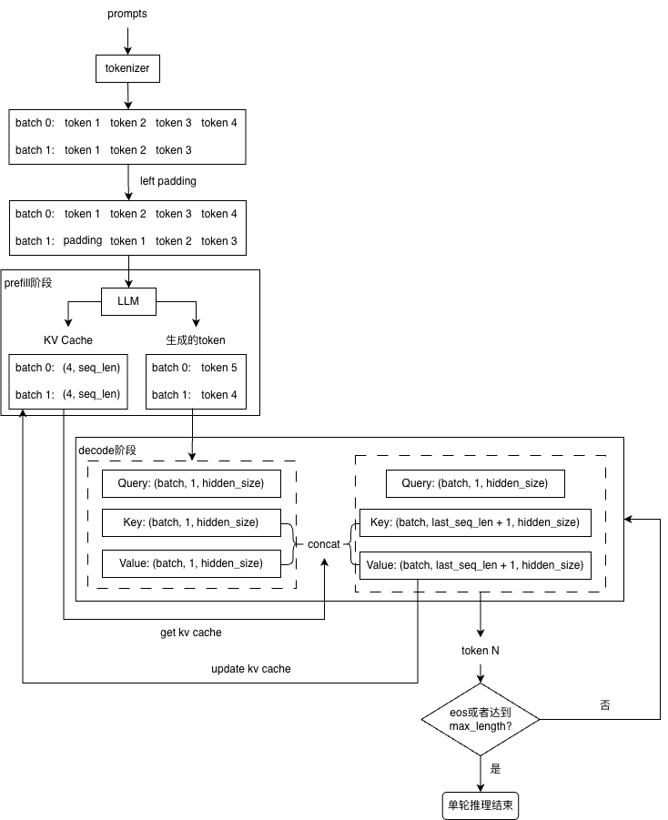

# FG42
供个人学习的LLM推理引擎，实现了文生文LLM推理流程。

## 主要功能
* 支持 Safetensors 模型加载
* 支持 CPU 与 CUDA 推理
* 支持 BF16 与 FP32 权重
* 支持多 batch 推理
* 支持 GQA 与 MQA
* 支持 KV Cache 机制
* 支持贪心采样、温度采样
* 支持 Qwen2 和 Qwen2.5 模型（可自行扩展）

## 使用方法及推理效果
* 编译命令
```bash
mkdir build
cd build
cmake ..
make
```
* Windows平台下，cmdline库编译可能出现报错，需修改external/cmdline/cmdline.h源码，解决办法如下
    - [无法打开包括文件:“cxxabi.h”: No such file or directory](https://github.com/tanakh/cmdline/issues/6)
    -  ['(' : illegal token on right side of '::'](https://github.com/tanakh/cmdline/issues/13)
* 推理效果


## 整体流程
* 模型加载  
1. Linux：使用mmap加载权重文件
2. Windows：使用标准库std::ifstream加载权重文件

* 推理流程

    1. Left Padding：对于多batch数据，需要进行左填充，使得每个batch的prompt长度一致。
    2. Prefill阶段：当前batch的prompt进行一次前向推理；若开启KV Cache，则会初始化KV Cache。
    3. Decode阶段：
        - 开启KV Cache：**将上一次生成的最后一个token，作为模型输入进行前向推理**；推理时，**只使用最新的Q，拼接当前KV与之前缓存的KV后计算注意力**；
        - 未开启KV Cache：直接将当前生成的token，**与之前生成的所有token进行拼接**，作为下一个模型输入进行前向推理。
    4. 采样阶段：根据采样策略，从模型输出的概率中，采样得出下一个token。

* Prefill & Decode
    1. Prefill：前向推理一次，但是token数量较多，所以是**内存密集型任务**。
    2. Decode：前向推理多次，但是token数量较少（只取上次生成的token作为输入），所以是**计算密集型任务**。

## 未来计划
* 多卡PD分离
    - Prefill实例与Decode实例分离；
    - Prefill后的KV Cache，由Decode实例进行消费；
    - 单机多卡时，KV Cache元数据（Tensor数据类型、形状等）通过ZeroMQ传输，Tensor通过 NCCL（内部实现为通过NVLink） 传输；
    - 多机多卡时，KV Cache元数据（Tensor数据类型、形状等）通过ZeroMQ传输，Tensor通过 RDMA + NCCL 传输。

* KV Cache 显存管理优化：Paged Attention
    1. 为什么需要优化？
        - KV Cache若连续存储，且为KV Cache预分配max_length的空间时，当LLM最终只生成了远小于max_length的token数量时，会造成空间严重浪费；
        - KV Cache若连续存储，但不预分配空间，采用动态拼接的方式，则会造成显存频繁分配与释放，影响性能。
    2. Paged Attention优化思路：
        - 参考操作系统分页内存管理，**将KV Cache分块存储**，每块存储固定数量的token；
        - 还可以通过记录token的哈希值，实现跨对话的prefix cache。

* 访存优化：Flash Attention
    - 思路：尽量地在SRAM中进行分块计算，减少对显存的读写。

